<div align="center">

# 🔐 Password Recovery & AI-Assisted Offensive Security Setup


-yellow?style=flat-square)

**Cybersecurity Internship &middot; Networkwalks Academy, Batch B082**

Password Recovery &middot; Dictionary Attacks &middot; AI-Assisted Offensive Tooling

</div>

---

## Objective

This module built hands-on experience with two connected areas of offensive security: recovering passwords from protected files using classic dictionary-attack tooling, and integrating a modern AI-assisted offensive security toolkit directly into a live testing workflow.

The exercise covered two parts:

1. **Password Recovery** &mdash; extracting crackable hashes from password-protected PDF files and recovering the original passwords using John the Ripper.
2. **AI-Assisted Offensive Security Setup** &mdash; installing HexStrike AI in an isolated environment and connecting it to Claude Desktop as a live MCP (Model Context Protocol) server, so AI-driven analysis can be used directly inside a security workflow.

---

## Why This Matters

Password cracking is one of the oldest techniques in offensive security, and still one of the most relevant. Weak or reused passwords remain one of the most common ways real systems get compromised, and understanding how a dictionary attack actually works, hash extraction, wordlist matching, and cracking speed, builds intuition for why password policy and hashing algorithm choice matter so much on the defensive side.

The second half of this module looked forward rather than back: wiring an AI system into offensive tooling via MCP so that natural-language requests can drive real security tools. This is an increasingly common pattern in modern security operations, and setting it up hands-on, rather than just reading about it, was the point of this exercise.

---

## Lab Environment

| Component | Configuration |
|---|---|
| Host Platform | Oracle VirtualBox |
| Guest OS | Kali Linux |
| Password Recovery Tool | John the Ripper (JtR), CLI |
| Hash Extraction Tool | pdf2john |
| AI Toolkit | HexStrike AI |
| Integration Method | MCP (Model Context Protocol) server, registered in Claude Desktop |
| Target Files | 3x password-protected PDF files (`My Locked PDF1/2/3.pdf`) |

---

## Part 1: Password Recovery with John the Ripper

### Step 1 &middot; Confirm Tooling is Available

Verified `pdf2john` was available on the system before starting.

```bash
which pdf2john
```

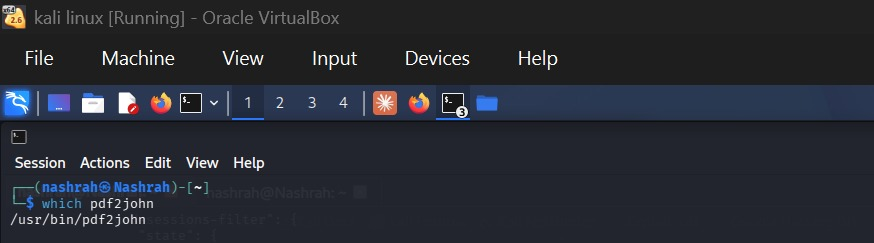

### Step 2 &middot; Extract a Crackable Hash from Each PDF

Used `pdf2john` to convert each locked PDF into a hash format John the Ripper can work with, then verified the extracted hash.

```bash
pdf2john "$HOME/Desktop/My Locked PDF2.pdf" > hash1.txt
cat hash1.txt
```

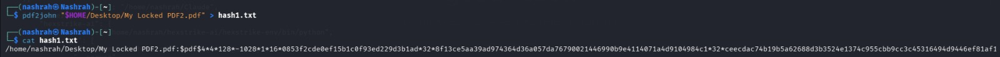

### Step 3 &middot; Run the Dictionary Attack

Ran John the Ripper against each extracted hash using the default system wordlist.

```bash
john hash1.txt
```

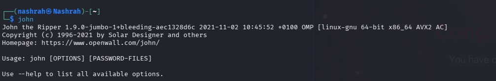

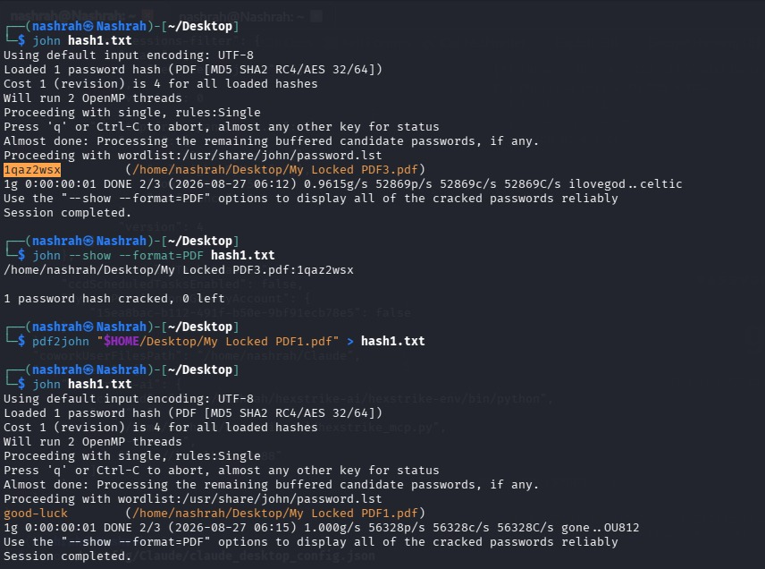

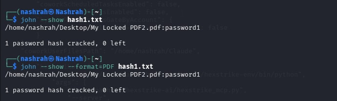

### Step 4 &middot; Confirm Each Cracked Password

Used John's `--show` flag to display the recovered credentials clearly for each file.

```bash
john --show --format=PDF hash1.txt
```

### Step 5 &middot; Open Each File and Capture the Flag

Unlocked each PDF using its recovered password and confirmed success by capturing the embedded flag inside.

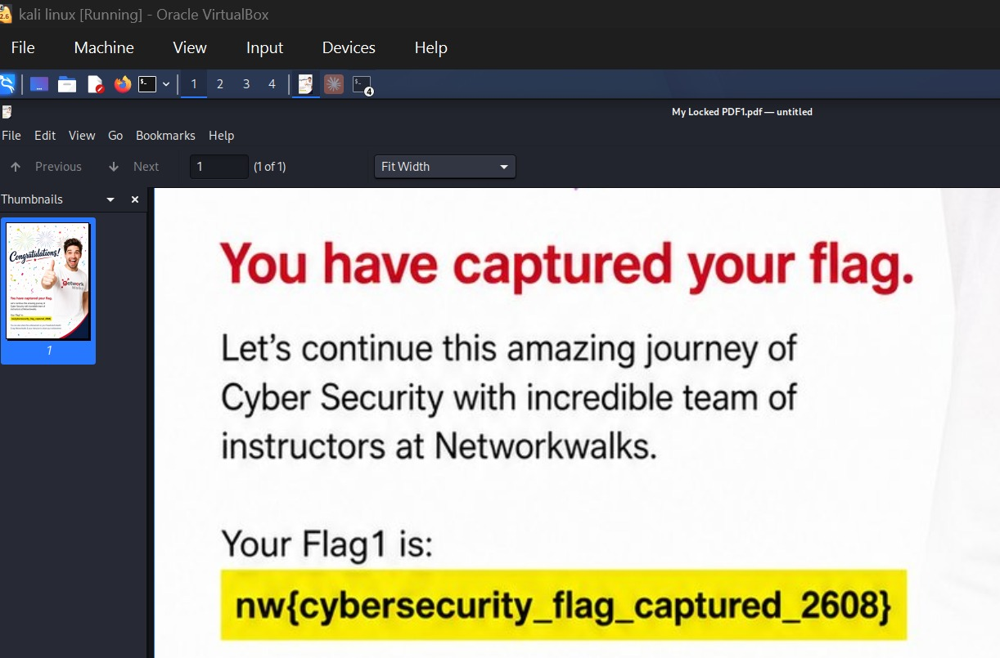

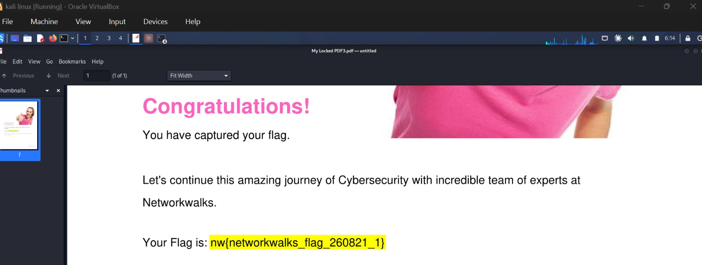

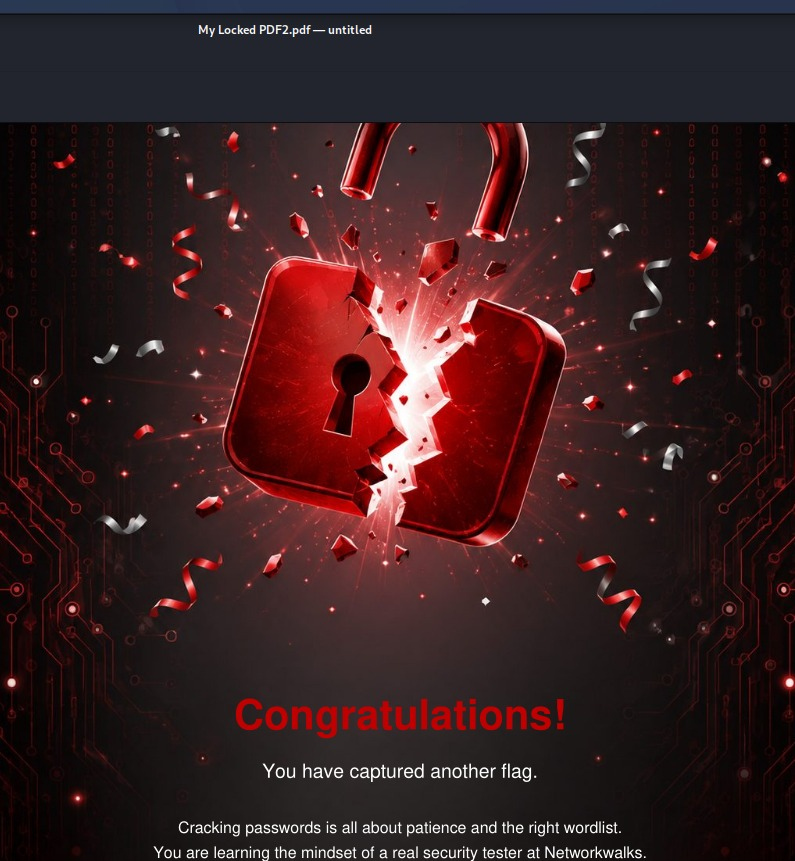

### Results

| File | Password Recovered | Flag / Outcome |
|---|---|---|
| My Locked PDF1.pdf | `good-luck` | `nw{cybersecurity_flag_captured_2608}` |
| My Locked PDF2.pdf | `password1` | Flag captured |
| My Locked PDF3.pdf | `1qaz2wsx` | `nw{networkwalks_flag_260821_1}` |

### Step 6 &middot; Cross-Check the Concepts with Networkwalks' Web Tools

Used Networkwalks Academy's own browser-based labs to independently verify the hashing and dictionary-attack concepts used above, entirely client-side, with no data leaving the browser.

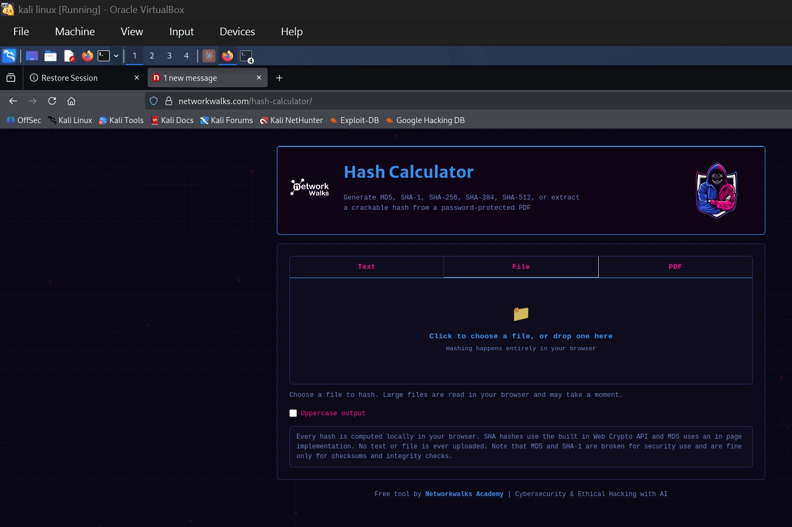

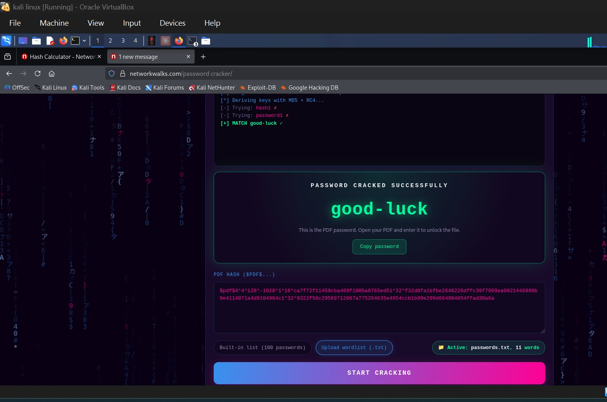

---

## Part 2: AI-Assisted Offensive Security Setup (HexStrike AI + Claude MCP)

### Step 1 &middot; Install HexStrike AI in an Isolated Environment

Cloned the HexStrike AI toolkit into its own directory and set up an isolated Python virtual environment before installing any dependencies.

```bash
git clone https://github.com/0x4m4/hexstrike-ai.git
cd hexstrike-ai
python3 -m venv hexstrike-env
source hexstrike-env/bin/activate
pip3 install -r requirements.txt
```

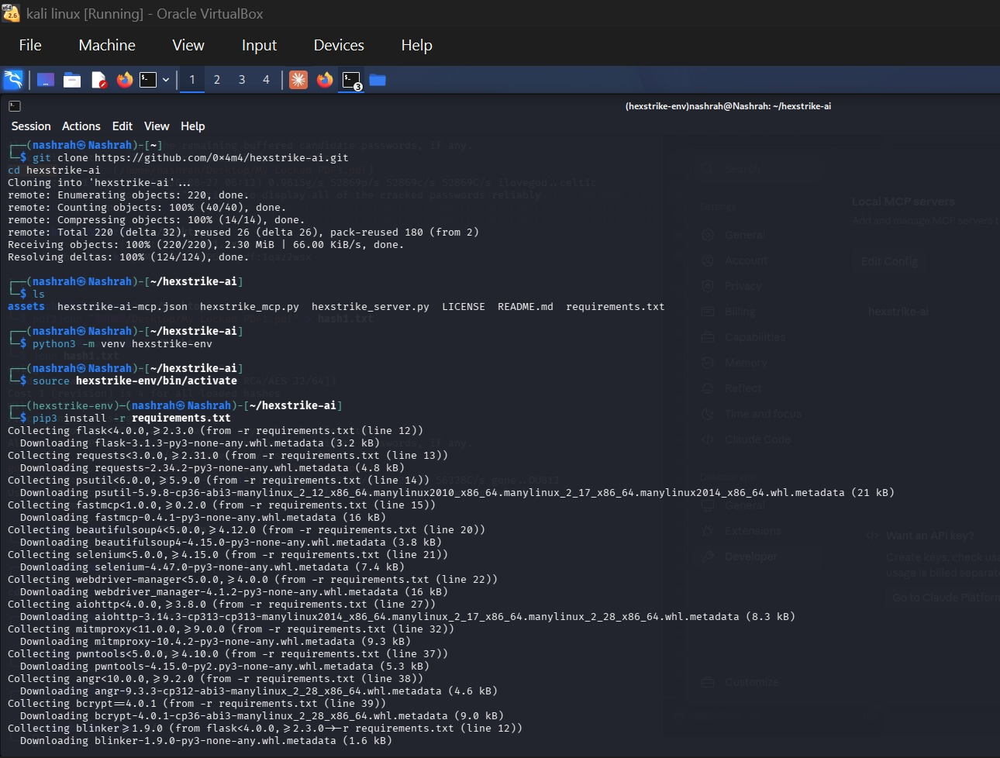

### Step 2 &middot; Register HexStrike AI as a Local MCP Server

Edited Claude Desktop's local configuration to register HexStrike AI as an MCP server, pointing it at the toolkit's server script inside the isolated virtual environment.

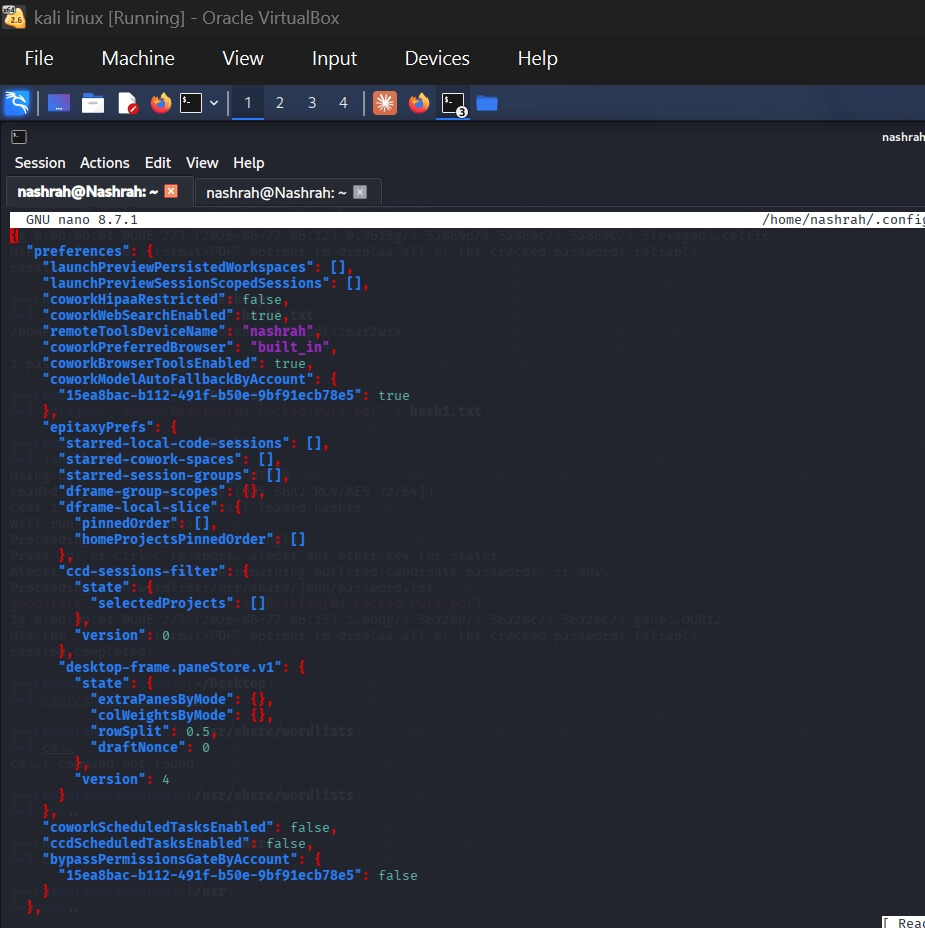

### Step 3 &middot; Launch the Server and Confirm the Connection

Started the HexStrike AI API server and confirmed it appeared as a running, connected MCP server inside Claude Desktop's settings.

```bash
python3 hexstrike_server.py
```

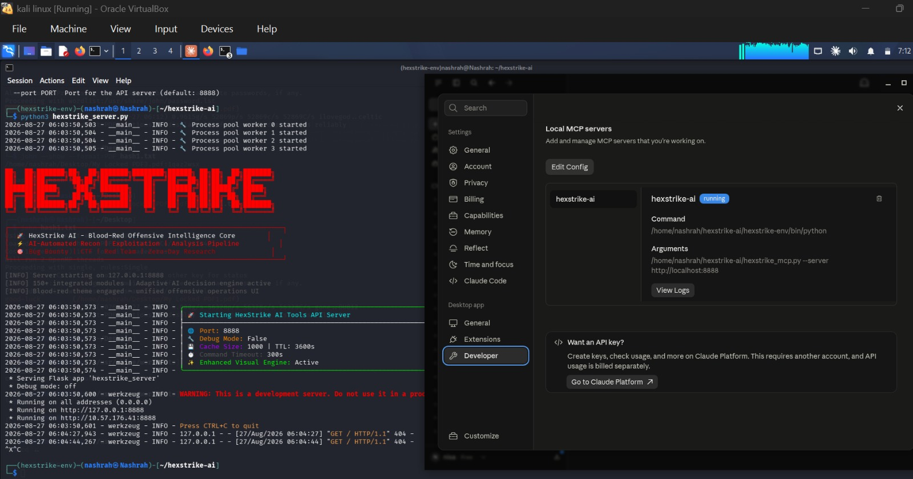

With the server active and registered, Claude Desktop can now call HexStrike AI's tooling directly as part of a natural-language security workflow, bridging AI-assisted reasoning with real offensive security tools.

---

## What I Learned

**Hash extraction is the real first step, not the attack itself.** Before John the Ripper can do anything, the password hash has to be pulled out of the file in a format it understands. `pdf2john` doing that conversion cleanly is what makes the rest of the attack possible.

**Dictionary attacks are only as good as the wordlist.** All three passwords cracked here were common, human-guessable patterns (`good-luck`, `password1`, `1qaz2wsx`), exactly the kind of password a standard wordlist catches quickly. It reinforced why password policies that block common patterns matter more than just requiring "complexity."

**`--show` matters for reporting, not just cracking.** Actually recovering a password and clearly displaying it for verification are two different steps. Getting into the habit of confirming and documenting the result, not just watching the crack happen, is part of doing this properly.

**MCP is a genuinely different way to use AI in security work.** Registering HexStrike AI as an MCP server and connecting it to Claude Desktop wasn't just an install step, it changes the interaction model from "run a tool manually" to "describe what you want and let the AI drive the tool." Setting this up hands-on made that shift concrete rather than theoretical.

---

## Tools Used

| Tool | Category | What It Does |
|---|---|---|
| pdf2john | CLI | Extracts a crackable hash from a password-protected PDF |
| John the Ripper | CLI | Runs dictionary/brute-force attacks against extracted password hashes |
| Networkwalks Hash Calculator | Web tool | Generates and inspects hashes client-side for concept verification |
| Networkwalks Password Cracker Lab | Web tool | Visual dictionary-attack simulator for reinforcing the underlying concept |
| HexStrike AI | AI-assisted toolkit | Provides AI-driven offensive security tooling exposed via MCP |
| Claude Desktop | AI client | Connects to HexStrike AI as an MCP server to drive tooling via natural language |

---

## Ethical Use Statement

All files cracked in this exercise were provided as part of an authorized, sandboxed internship training module. HexStrike AI was installed and run entirely within an isolated virtual machine. None of the tools or techniques documented here were used against any system outside this controlled training environment.

---

## Author

**Nashrah Bashir**
Cybersecurity Intern &middot; Batch B082
Networkwalks Academy
Mentor: Waqas Karim (CCIE)

LinkedIn: [View Profile](https://www.linkedin.com/in/nashrah-bashir/)

---

## Project Information

**Internship:** Cybersecurity Internship
**Module:** Password Recovery & AI-Assisted Offensive Security Setup
**Organization:** Networkwalks Academy
